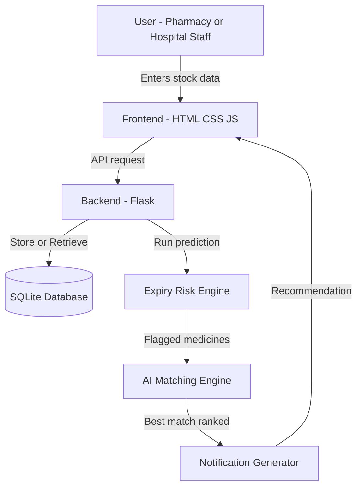

# Architecture

## System Diagram

## Component Table

| Component | Technology | Responsibility |
|---|---|---|
| Frontend | HTML, CSS, JavaScript | Displays stock dashboard, expiry alerts, and match recommendations to users |
| Backend / API | Python (Flask) | Handles requests between frontend and database; runs core logic |
| Database | SQLite | Stores registered medicine stock, facility info, and transfer history |
| Expiry Risk Engine | Python | Scans stock data and flags medicines nearing expiry (30/15/7-day thresholds) |
| AI Matching Engine | Python | Ranks other facilities by need, quantity fit, and proximity for each flagged medicine |
| Notification Generator | Python | Drafts a reasoned explanation and recommendation message for each match |
| Development Tool | IBM Bob | Used to scaffold, build, and debug the backend and matching logic |

## Data Flow (End-to-End)

1. Staff registers medicine stock (name, quantity, manufacture date, expiry date) via the frontend.
2. Data is sent to the Flask backend and stored in the SQLite database.
3. The Expiry Risk Engine scans stock and flags items nearing expiry.
4. For each flagged item, the AI Matching Engine queries the database for other facilities with matching need.
5. The best-ranked match is passed to the Notification Generator, which creates a human-readable recommendation.
6. The recommendation is displayed on the dashboard for both facilities to review and approve.

## Security and Scalability Notes

- Current scope (hackathon version) uses simulated data and does not implement production-grade authentication or encryption; it is intended to demonstrate the core prediction-and-matching logic.
- For production use, facility-level authentication, encrypted storage of stock data, and role-based access would be required so only authorized staff can approve transfers.
- Matching logic currently runs against a small simulated dataset; a production version would need database indexing and optimization to handle matching across hundreds of facilities in real time.